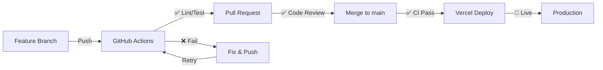

# Deployment Guide

## Quick Start

This app is optimized for deployment on **Vercel**. A free tier can handle development and staging.

---

## ☁️ Vercel Deployment

### 1. Prerequisites

- GitHub account with your fork of cert-prep
- Vercel account (free at [vercel.com](https://vercel.com))
- Supabase project with credentials

### 2. Deploy to Vercel

**Option A: Quick Deploy (Recommended)**

```bash
npm install -g vercel
vercel
# Follow prompts, link to GitHub repo
```

**Option B: Via Vercel Dashboard**

1. Go to [vercel.com/new](https://vercel.com/new)
2. Import your GitHub repository
3. Choose framework preset: **Vite**
4. Configure environment variables (see below)
5. Deploy

### 3. Environment Variables

In Vercel Dashboard → Settings → Environment Variables, add:

| Variable                 | Value                      | Note                    |
| ------------------------ | -------------------------- | ----------------------- |
| `VITE_SUPABASE_URL`      | `https://xxxx.supabase.co` | From Supabase dashboard |
| `VITE_SUPABASE_ANON_KEY` | `eyJhbGciOiJI...`          | Public anon key (safe)  |

⚠️ **Never add `SUPABASE_SERVICE_ROLE_KEY`** — it's only for local development.

---

## 🐳 Docker Deployment

For custom hosting (AWS, GCP, DigitalOcean, etc.):

```bash
# Build image
docker build \
  --build-arg VITE_SUPABASE_URL=https://xxxx.supabase.co \
  --build-arg VITE_SUPABASE_ANON_KEY=your-key \
  -t cert-prep:latest .

# Run locally
docker run -p 8080:8080 cert-prep:latest

# Push to registry
docker tag cert-prep:latest myregistry/cert-prep:latest
docker push myregistry/cert-prep:latest
```

The app is served by Nginx at `http://localhost:8080`.

---

## 🚀 CI/CD Pipeline

### GitHub Actions (Automatic)

On every push:

1. **Lint & Type Check** — ESLint, TypeScript strict mode
2. **Tests** — Vitest with 80%+ coverage
3. **E2E Tests** — Playwright (Chrome, Firefox, Safari)
4. **Build** — Production build optimization
5. **Security** — Secrets scan, CodeQL analysis, dependency audit

All checks must pass before merge to `main`.

### Vercel Deployments

- **Preview Deployments** — Every PR gets a unique preview URL
- **Production Deployment** — Automatic on merge to `main`
- **Rollback** — Easy one-click rollback if needed

---

## 📊 Monitoring & Health Checks

### Vercel Built-in

- ✅ Uptime monitoring
- ✅ Response time alerts
- ✅ Error tracking (via Sentry integration, optional)

### Application Health

Check deployment health:

```bash
curl https://your-deployment.vercel.app/
# Should return 200 OK with HTML
```

### Environment Validation

The app validates environment variables at startup:

```typescript
// src/main.tsx
if (!import.meta.env.VITE_SUPABASE_URL) {
  throw new Error('Missing VITE_SUPABASE_URL');
}
```

If validation fails, the app won't render and logs an error.

---

## 🔧 Configuration Files

### `vercel.json`

Defines build settings, environment variables, and security headers:

```json
{
  "buildCommand": "npm run build",
  "outputDirectory": "dist",
  "env": {
    "VITE_SUPABASE_URL": "@vite_supabase_url"
  },
  "headers": [
    {
      "key": "X-Content-Type-Options",
      "value": "nosniff"
    }
  ]
}
```

### `.vercelignore`

Files excluded from deployment (reduces build time):

```
.git
node_modules
tests
e2e
coverage
scripts
```

### `nginx.conf`

Served by Nginx with security headers and SPA routing.

---

## 🔐 Security Checklist

Before deploying to production:

- [ ] Supabase URL is production, not development
- [ ] Anon key is the **public** key, not service role
- [ ] Row-level security policies are enabled in Supabase
- [ ] HTTPS is enforced (Vercel does this automatically)
- [ ] Security headers are present (see `vercel.json`)
- [ ] Email verification is enabled in Supabase Auth
- [ ] No secrets in environment variables (only public values)
- [ ] Error messages don't leak sensitive data

---

## 🔄 Deployment Workflow



### Step-by-Step

1. **Create feature branch** from `main`
2. **Push commits** — CI runs automatically
3. **Create PR** with description and checklist
4. **Wait for CI** to pass (lint, tests, E2E)
5. **Code review** — At least one approval
6. **Merge to main** — Squash or rebase (your choice)
7. **Vercel deploys** — Automatic production deployment
8. **Verify** — Test the live site

---

## 📈 Performance Metrics

Monitor in Vercel Dashboard:

- **Response Time** — Target < 200ms
- **CPU** — Should stay under 80%
- **Memory** — Typically 100-200MB
- **Build Time** — Target < 2 minutes

If metrics spike:

1. Check recent deployments
2. Review error logs
3. Rollback if needed
4. Fix issue and redeploy

---

## 🆘 Troubleshooting

### Deployment Failed

**Check:**

```bash
vercel logs [deployment-id]  # View logs
vercel env ls                 # Verify env vars
npm run build                # Test build locally
```

**Common Issues:**

| Issue            | Solution                             |
| ---------------- | ------------------------------------ |
| Missing env vars | Add in Vercel Dashboard → Settings   |
| Build timeout    | Increase memory or optimize build    |
| 404 errors       | Check `vercel.json` rewrites for SPA |
| CORS errors      | Verify Supabase CORS config          |

### App Won't Load

1. Check browser DevTools → Console
2. Verify env vars are set
3. Check Supabase is accessible
4. Rollback to last working deployment

### High Response Times

1. Monitor bundle size: `npm run build`
2. Check Supabase query performance
3. Enable caching in `vercel.json`
4. Consider edge caching (Vercel Pro)

---

## 🔄 Rollback

If something breaks:

**In Vercel Dashboard:**

1. Deployments → Find previous working version
2. Click "..." → Promote to Production
3. Done! ✅

---

## 📚 Related Documentation

- [Vercel Docs](https://vercel.com/docs)
- [Vite Deployment](https://vitejs.dev/guide/build.html)
- [Supabase Hosting](https://supabase.com/docs/guides/hosting/supabase)
- [Docker Docs](https://docs.docker.com/)

---

## 🎯 Production Checklist

- [ ] Supabase project configured and secured
- [ ] Environment variables set in Vercel
- [ ] HTTPS enabled (automatic on Vercel)
- [ ] Security headers in place
- [ ] Monitoring configured
- [ ] Error tracking set up (Sentry, etc.)
- [ ] Performance metrics acceptable
- [ ] All CI tests passing
- [ ] User can sign up and access features
- [ ] Progress saves and persists

---

**Ready to deploy! 🚀**

For questions, see [CONTRIBUTING.md](CONTRIBUTING.md) or [SECURITY.md](SECURITY.md).
